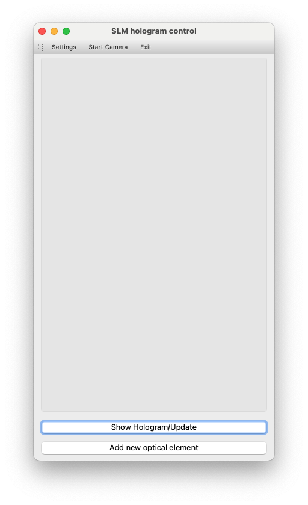
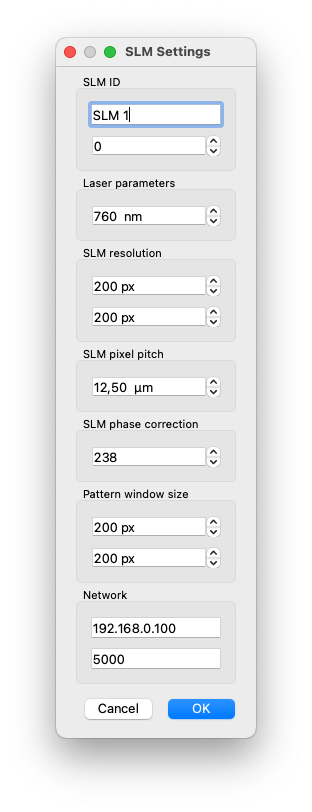
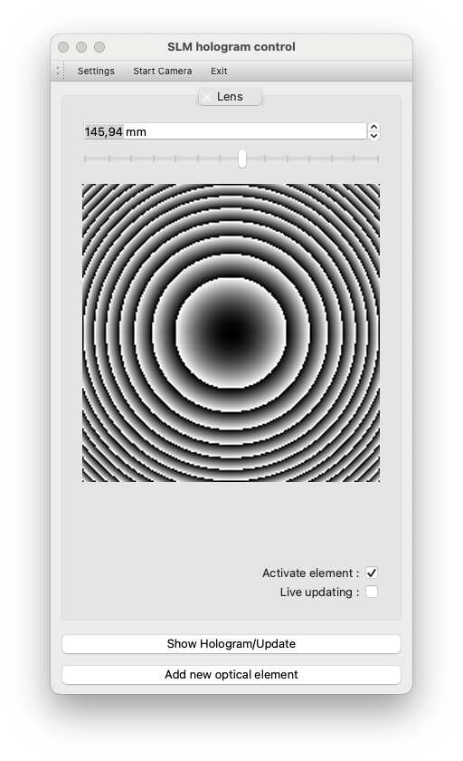
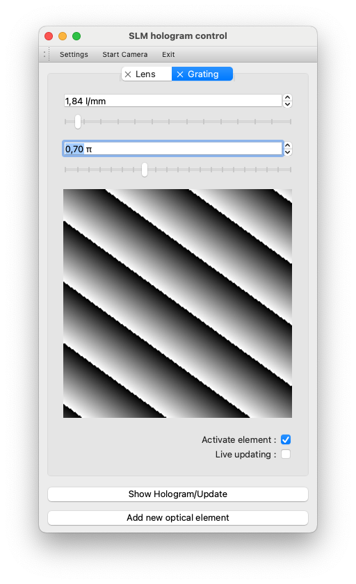

# SLM_controller

SLM_controller is a python based GUI software for controlling the phase pattern of an SLM (Spatial Light Modulator).
The software takes care of rendering the hologram on top of any graphical interface of the operative system used. For now it has been tested on windows 10/11 and ubuntu 22.04.

The software offers various types of static holograms that are normally used in the field of optical tweezers.

From the main window it is possible to add new optical elements and toggle the rendering of the hologram.

Before doing that however the user should set-up the parameters of his SLM and system. 
In the settings windows it is possible to set the following parameters :
* SLM ID : This is an identifier for that particular SLM. In future I plan to provide support for multiple SLMs. Under it the user can select on which monitor the SLM pattern should be rendered. 0 = main monitor. Here the typical selection should be 1 (first external monitor, SLM)
* Laser parameters : The wavelength of the laser used, this is used for calculating the correct lens pattern.
* SLM resolution : This is the resolution (number of pixels) of the SLM. Beware that it can be different than the screen resolution seen by the operative system. Many SLMs use standard resolution values (eg. Full-HD) even if their effective number of pixels is different than (1920x1080).
* SLM pixel pitch : The pixel size of the SLM
* SLM phase correction : This is the correction value for a 2π phase modulation. The value is nomally provided by the manufacturing company. Typically 2π --> 255 but at different wavelengths this value can vary
* Pattern window size : This should be the screen resolution used for the SLM (eg. Full-HD) not the number of pixels of the SLM (although the two might match). The unused (SLM resolution - window size) pixels will be rendered as black. 

## Optical elements
It is possible to add various optical elements through the software. Each optical element will have a control tab where it can be activated/deactivated. The final full phase pattern rendered on the SLM will be the sum of all the active optical elements at the moment the user press "Show hologram/Update"

Some optical elements have a "live update" feature. The live update permits to change the parameters of the optical element and automatically re-render the whole SLM pattern each time a value is changed. Beware that this works fine on good PCs but can require quite some time on old PCs or when many optical elements are active at once.

### Fresnel lens pattern
It is possible to add a virtual lens on the SLM by generating a fresnel lens pattern (fresnel zone plate). This can be done by adding a new "lens" optical element.

In the tab it is possible to control the focus of the lens and activate/deactivate it.

### Grating
This adds a virtual diffractive grating. It is possible to control the lines/mm of the grating and its orientation. The number of lines per pixel will depend on the size of each SLM pixel.

{: .center-image-caption}

### Flatness correction
This controls the flatness correction pattern typically used to correct for flatness imperfections of the SLM. The SLM manufacturing company normally provides a file for each wavelength supported by the SLM. This can be added to the total pattern by selecting the proper flatness correction for the used wavelength.
The flatness correction is normally an image and its size should match the SLM size.

